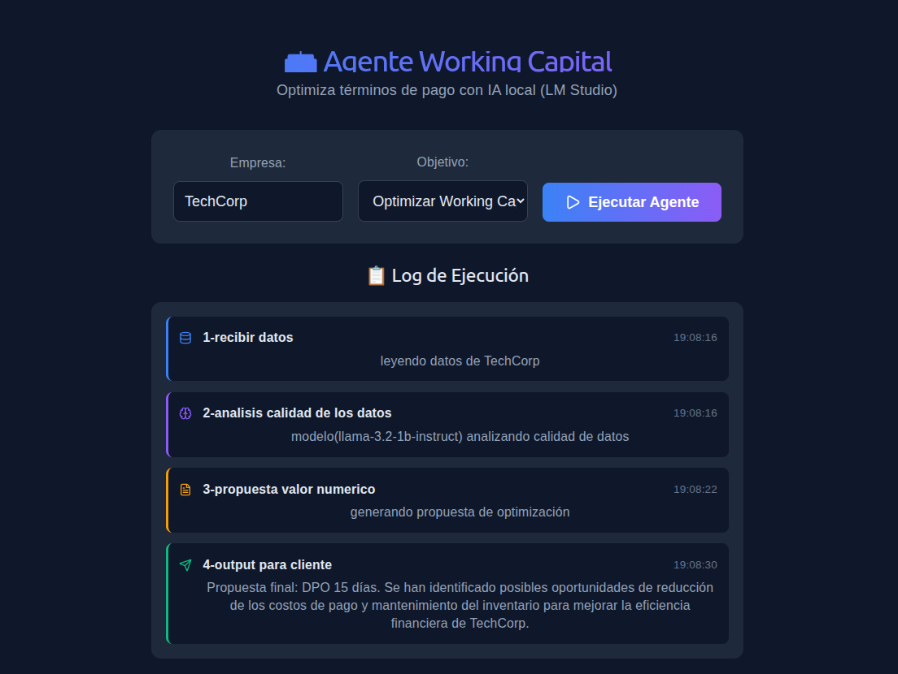
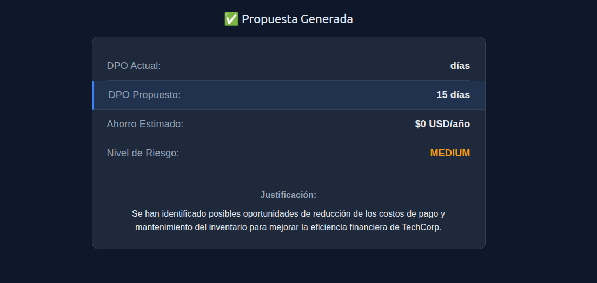

# Agente Working Capital con LangGraph y MCP

Demo de un agente autónomo que optimiza plazos de pago (DPO) usando un LLM local (LM Studio), LangGraph para la orquestación y FastAPI en el backend. El frontend está hecho con React y muestra logs en tiempo real.

Este proyecto se hizo como parte del proceso de selección para el puesto de AI Engineer en Calculum.

## ¿Qué hace el agente?

1. Lee datos simulados de proveedores (mock de un ERP).
2. Usa un LLM para analizar si la información es suficiente.
3. Si faltan datos, vuelve al paso 1 (ciclo). Si no, genera una propuesta de nuevo DPO con ahorro estimado y nivel de riesgo.
4. Muestra el resultado en el frontend.

## Arquitectura

- **Backend**: FastAPI + LangGraph (máquina de estados con nodos y aristas condicionales).
- **Frontend**: React + TypeScript + Vite.
- **LLM**: LM Studio ejecutando `llama-3.2-1b-instruct` en local.
- **MCP**: Preparado para conectar con PostgreSQL real (código incluido).

## Capturas



*Ejemplo de ejecución completa*



*Detalle de la propuesta generada*

## Cómo ejecutar

### Requisitos

- Python 3.12
- Node.js 18
- LM Studio con el modelo `llama-3.2-1b-instruct` (o similar) corriendo en `http://localhost:1234`

### Backend

```bash
cd backend
python -m venv venv
source venv/bin/activate   # Linux/Mac
pip install fastapi uvicorn langgraph pydantic requests sse-starlette
python main.py
